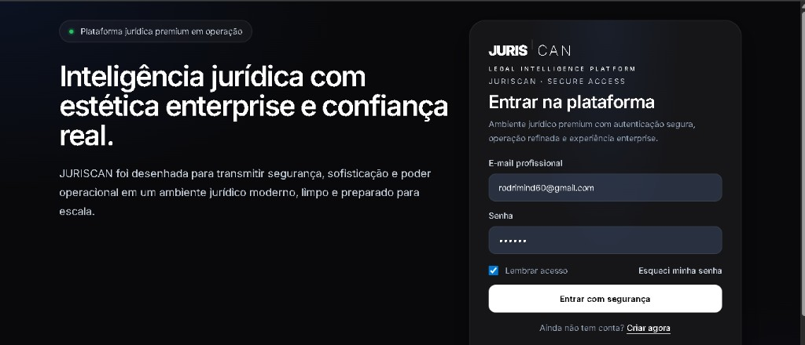
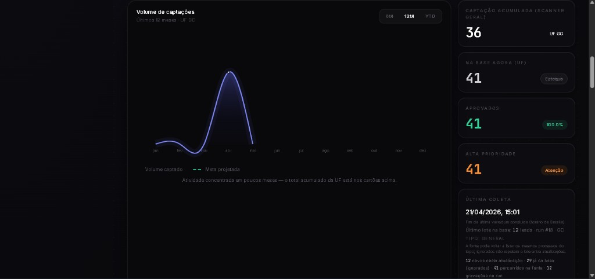

# Rodrigo Fabrício Velozo (RodrinexusIA)

Full‑Stack Developer com foco em **SaaS**, **automação** e **cibersegurança defensiva**. O meu trabalho de maior ambição é a **JURISCAN** — uma **engine de inteligência jurídica** com **enriquecimento de dados**, **governança** e **segurança amparada em LGPD**.

- **GitHub**: [@RodrinexusIA](https://github.com/RodrinexusIA)
- **LinkedIn**: [Rodrigo Fabrício Velozo](https://www.linkedin.com/in/rodrigo-fabricio-velozo-63256b37b)
- **Instituto/Marca**: Instituto Nexus

## JURISCAN — engine de inteligência jurídica (produto principal)

A **JURISCAN** é o meu **maior projeto**: uma plataforma **enterprise** para **inteligência operacional** no mundo jurídico — desde **captação e monitorização** de volume até **cartões de decisão** (acumulados, estoque, aprovações, prioridade, última coleta), com **UX premium** e narrativa de **confiança** (autenticação segura, ambiente preparado para escala).

- **Privado:** código-fonte, conectores, motor de regras e dados sensíveis **não** são públicos (proteção de **IP** e de titulares).
- **Público (vitrine):** repositório só com **README + capturas** — credibilidade sem “entregar a chave”.
- **Repo da vitrine:** [**RodrinexusIA/juriscan**](https://github.com/RodrinexusIA/juriscan)

**LGPD e segurança** estão no desenho do produto: **minimização**, **finalidade**, **controlo de acessos**, **auditoria operacional**, **HTTPS**, segregação de ambientes e mentalidade **least privilege** em APIs e workers. O repositório da vitrine **não inclui** dados reais de titulares.

## Especialidades (o que eu faço bem)

- **Engines SaaS jurídicas**: filas, workers, consistência de dados, painéis acionáveis
- **Full‑Stack pragmático**: Next.js + APIs resilientes (FastAPI) + Postgres + Redis
- **Segurança defensiva**: análise de malware, engenharia de detecção, mindset de hardening

## Tech stack (o que uso no dia a dia)

Stack consolidada na **JURISCAN** / pipeline judicial (**FastAPI + Celery + Postgres + Redis** + **Next.js**).

### Backend / APIs

- **Python 3.12** • **FastAPI** • **Uvicorn** • **Pydantic v2** • **Pydantic Settings**
- **SQLAlchemy 2** • **Alembic** (migrações)
- **Celery** (workers + beat) • **Redis** (broker/backend/cache)
- **PostgreSQL** (**psycopg** 3)
- **HTTP**: `httpx`, `requests` • **Parsing / dados**: **BeautifulSoup4**, **pandas**, **openpyxl** (CSV/XLSX)
- **Testes**: **pytest**

### Frontend

- **Next.js 14** • **React 18** • **TypeScript**
- **Tailwind CSS** • **PostCSS** • **Autoprefixer**
- **Zustand** • **Framer Motion** • **Recharts** • **Lucide React** • exportação **XLSX** (cliente)

### Infra / DevOps

- **Docker** • **Docker Compose** (API, worker, beat, Postgres, Redis)
- **Railway** (deploy — `railway.toml` / variáveis de ambiente)
- Integrações via **`.env`** (CORS, `DATABASE_URL`, `REDIS_URL`, chaves de APIs judiciais) — **nunca** no git público

### Stack adicional (portfólio demo)

- **PHP 7.4** • **Laravel 5.7** • **Vue 2** • **Axios** • **Bootstrap** • **SweetAlert2** • **Laravel Mix (Webpack)** • **SQLite** (local)

### Segurança (labs e mindset)

- **YARA** • **Sigma** • threat detection • blue-team / hardening

## RodCassino — demo full‑stack (Laravel + Vue)

- **O que mostra**: landing premium, UI de jogos, autenticação, saldo validado no servidor, slots com giro no backend
- **Stack**: Laravel 5.7 + Vue 2 + SQLite (local)
- **Repo**: [RodrinexusIA/rodcassino](https://github.com/RodrinexusIA/rodcassino)

## Outros projetos em destaque

### RAT Defensive Analysis Lab — blue team / detecção

- **Repo**: [rat-defensive-analysis-lab](https://github.com/RodrinexusIA/rat-defensive-analysis-lab)

### Safe Exploit Education Lab — segurança defensiva (educacional)

- **Repo**: [safe-exploit-education-lab](https://github.com/RodrinexusIA/safe-exploit-education-lab)

## Pré-visualização (capturas de tela)

**Em primeiro:** **JURISCAN** (produto principal). Depois, labs e demo pública.

### JURISCAN — inteligência jurídica (UI)



  Acesso seguro — experiência enterprise 
  
    
  Painel — volume de captações e métricas operacionais 
  



### Safe Exploit Education Lab



  Laboratório educativo — relatório em terminal (simulação segura) 
  



### RodCassino (Laravel + Vue)



  
   
  



### RAT Defensive Analysis Lab



  Banner — <code>python samples/portfolio_banner.py</code> 
  
    
  Demo sanitizado — <code>python samples/sanitized-demo.py</code> 
  



## Fixar o `juriscan` no teu perfil GitHub

O GitHub só permite **fixar** repositórios pela interface (não dá para “forçar” por daqui):

1. Abre [github.com/RodrinexusIA](https://github.com/RodrinexusIA) (logado).
2. Em **“Popular repositories”**, clica **Customize pins**.
3. Marca **`juriscan`** (e, se quiseres, `rodcassino`, labs, etc.) até **6 pins**.

Assim o **motor jurídico** fica sempre visível no topo do perfil.

## Oportunidades

Estou aberto a oportunidades como:

- **Full‑Stack** (Next.js / React / Laravel / Vue)
- **Back‑end** (APIs / SaaS / Python / PHP)
- **Security (defensive / detection engineering)** — dependendo do contexto

## Contato

- **LinkedIn**: [linkedin.com/in/rodrigo-fabricio-velozo-63256b37b](https://www.linkedin.com/in/rodrigo-fabricio-velozo-63256b37b)
- **GitHub**: [@RodrinexusIA](https://github.com/RodrinexusIA)

