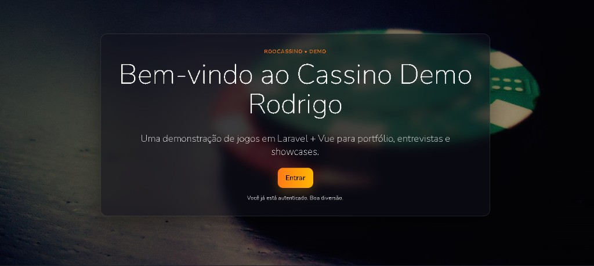
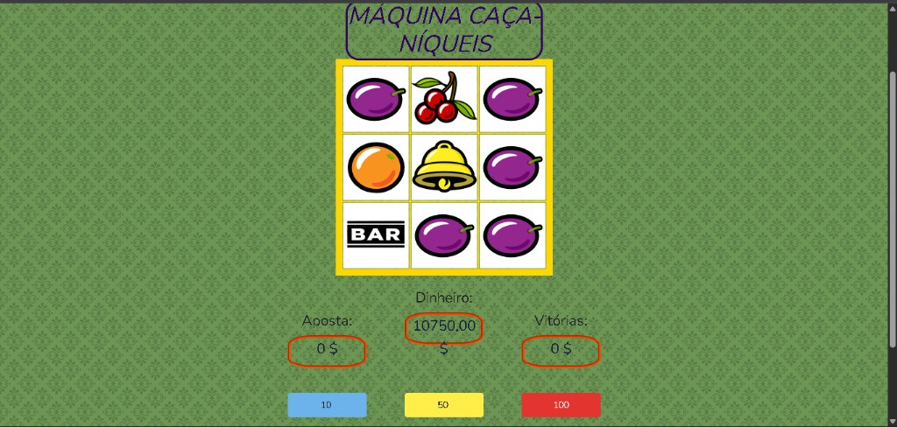
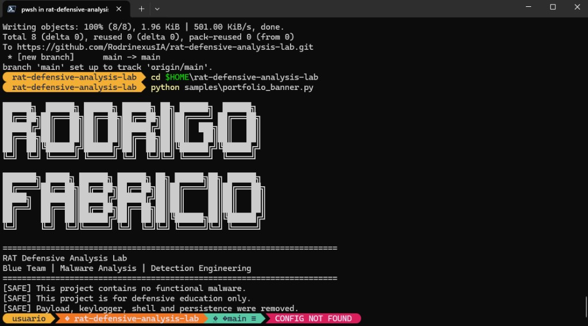
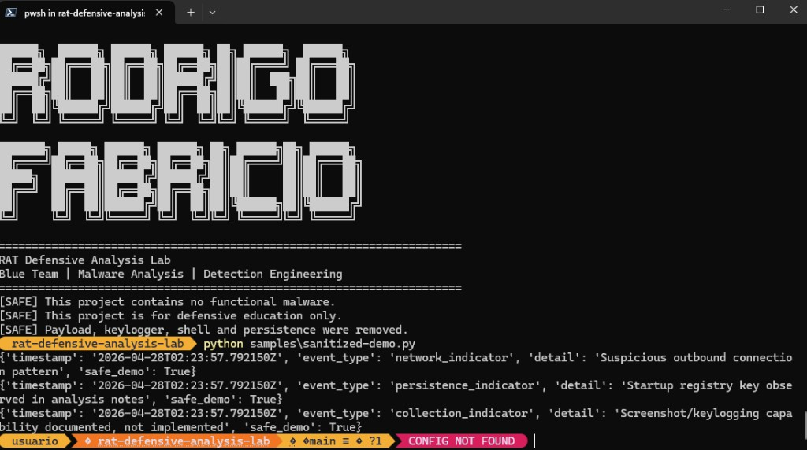
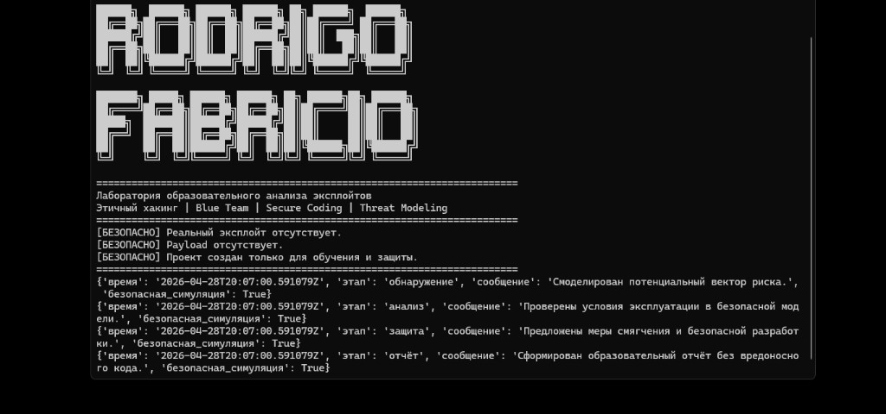

# Rodrigo Fabrício Velozo (RodrinexusIA)

Full‑Stack Developer com foco em **SaaS**, **automação** e **cibersegurança defensiva**. Entrego MVPs rápidos, mas com **back-end sólido**, **UI bem cuidada** e **preocupação real com segurança**.

- **GitHub**: [@RodrinexusIA](https://github.com/RodrinexusIA)
- **LinkedIn**: [Rodrigo Fabrício Velozo](https://www.linkedin.com/in/rodrigo-fabricio-velozo-63256b37b)
- **Instituto/Marca**: Instituto Nexus

## Especialidades (o que eu faço bem)

- **APIs e produtos SaaS**: autenticação (JWT/Bearer), regras de negócio, rotas protegidas, filas assíncronas, integrações externas
- **Full‑Stack pragmático**: back-end + front moderno (Next.js / Vue) para demonstrar produto funcionando ponta a ponta
- **Segurança defensiva**: análise de malware, engenharia de detecção, mindset de hardening

## Tech stack (o que uso no dia a dia)

Stack consolidada a partir do **SaaS judicial (NexJuris)** — backend em `judicialbackend` + frontend **Next.js** — e dos projetos públicos (ex.: **RodCassino**).

### Backend / APIs

- **Python 3.12** • **FastAPI** • **Uvicorn** • **Pydantic v2** • **Pydantic Settings**
- **SQLAlchemy 2** • **Alembic** (migrações)
- **Celery** (workers + beat) • **Redis** (broker/backend/cache)
- **PostgreSQL** (**psycopg** 3)
- **HTTP**: `httpx`, `requests` • **Parsing / dados**: **BeautifulSoup4**, **pandas**, **openpyxl** (CSV/XLSX)
- **Testes**: **pytest**

### Frontend

- **Next.js 14** • **React 18** • **TypeScript**
- **Tailwind CSS** • **PostCSS** • **Autoprefixer**
- **Zustand** • **Framer Motion** • **Recharts** • **Lucide React** • exportação **XLSX** (cliente)

### Infra / DevOps

- **Docker** • **Docker Compose** (API, worker, beat, Postgres, Redis)
- **Railway** (deploy — `railway.toml` / variáveis de ambiente)
- Integrações e configuração via **`.env`** (CORS, `DATABASE_URL`, `REDIS_URL`, chaves de APIs judiciais)

### Stack adicional (portfólio demo)

- **PHP 7.4** • **Laravel 5.7** • **Vue 2** • **Axios** • **Bootstrap** • **SweetAlert2** • **Laravel Mix (Webpack)** • **SQLite** (local)

### Segurança (labs e mindset)

- **YARA** • **Sigma** • threat detection • blue-team / hardening

## Produto principal (repositório privado)

O **SaaS judicial** (coleta, jobs assíncronos, consulta e exportação de dados — **DataJud** e evolução para outros conectores) é o projeto em que mais investi arquitetura (**FastAPI + Celery + Postgres + Redis** no backend; **Next.js** no front). **Não está público no GitHub** por ser o ativo principal (IP, modelo de negócio e credenciais/integrações); o que aparece aqui é a **stack real** que uso nele, espelhada nos repositórios locais de produção.

## RodCassino — demo full‑stack (Laravel + Vue)

- **O que mostra**: landing premium, UI de jogos, autenticação, saldo validado no servidor, slots com giro no backend
- **Stack**: Laravel 5.7 + Vue 2 + SQLite (local)
- **Repo**: [RodrinexusIA/rodcassino](https://github.com/RodrinexusIA/rodcassino)

## Outros projetos em destaque

### RAT Defensive Analysis Lab — blue team / detecção

- **Repo**: [rat-defensive-analysis-lab](https://github.com/RodrinexusIA/rat-defensive-analysis-lab)

### Safe Exploit Education Lab — segurança defensiva (educacional)

- **Repo**: [safe-exploit-education-lab](https://github.com/RodrinexusIA/safe-exploit-education-lab)

## Pré-visualização (capturas de tela)

Capturas alinhadas aos READMEs dos repositórios (**RodCassino**, **RAT Defensive Analysis Lab**, **Safe Exploit Education Lab**).

### RodCassino (Laravel + Vue)

  
   
  

### RAT Defensive Analysis Lab

  Banner — <code>python samples/portfolio_banner.py</code> 
  
    
  Demo sanitizado — <code>python samples/sanitized-demo.py</code> 
  

### Safe Exploit Education Lab

  Relatório / pipeline educativo (simulação segura) 
  

## Oportunidades

Estou aberto a oportunidades como:

- **Full‑Stack** (Next.js / React / Laravel / Vue)
- **Back‑end** (APIs / SaaS / Python / PHP)
- **Security (defensive / detection engineering)** — dependendo do contexto

## Contato

- **LinkedIn**: [linkedin.com/in/rodrigo-fabricio-velozo-63256b37b](https://www.linkedin.com/in/rodrigo-fabricio-velozo-63256b37b)
- **GitHub**: [@RodrinexusIA](https://github.com/RodrinexusIA)
